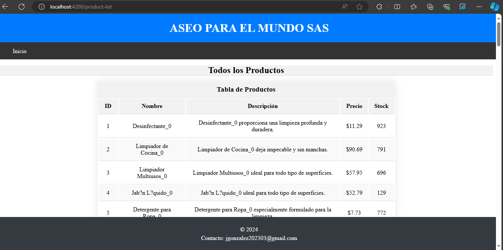
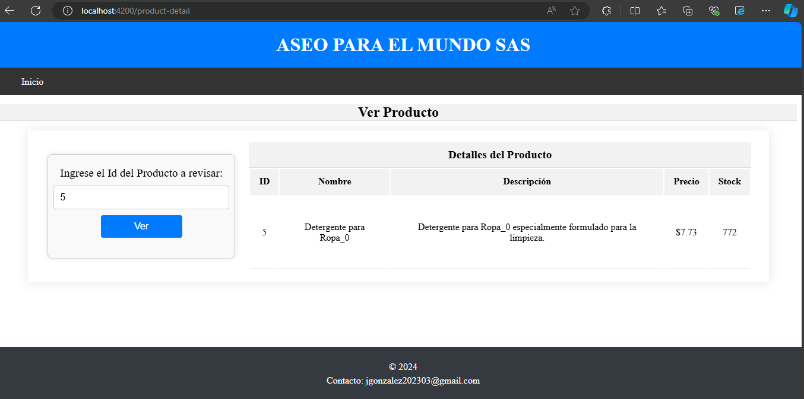
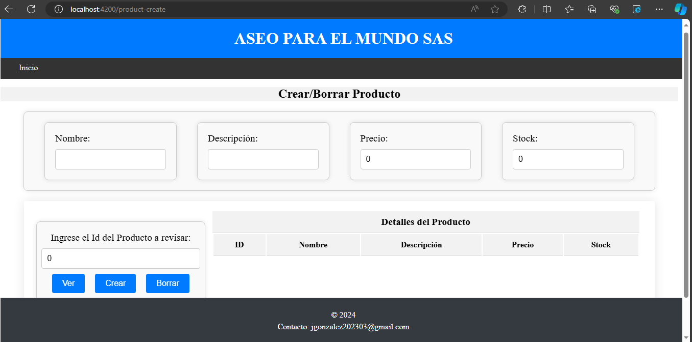
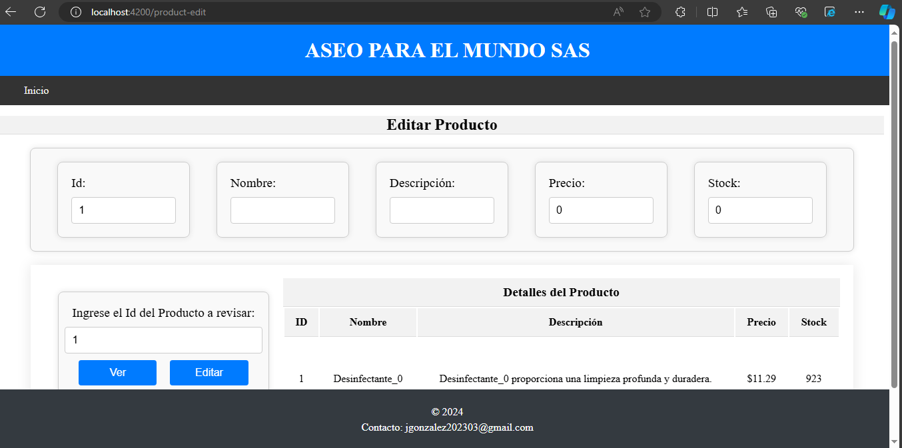

# ASEO PARA EL MUNDO SAS - SQL CRUD WEBAPP  
  
Un sistema CRUD (Create, Read, Update, Delete) para gestionar información de productos para ASEO PARA EL MUNDO SAS. Desarrollado utilizando Angular para el frontend y .NET Core para el backend, con una base de datos SQL Server para almacenar los datos.

## Tecnologías  
  
- .NET Core  
- Angular  
- SQL Server  
  
## Requisitos previos  
  
- Tener instalado .NET Core, puedes descargarlo [aquí](https://dotnet.microsoft.com/download)  
- Tener instalado Node.js y npm, puedes descargarlos [aquí](https://nodejs.org/en/download/)  
- Tener instalado Angular CLI, puedes instalarlo con `npm install -g @angular/cli`  
- Tener instalado SQL Server Express, puedes descargarlo [aquí](https://www.microsoft.com/en-us/sql-server/sql-server-downloads)  
  
## Instalación  
  
1. Clonar el repositorio: `git clone https://github.com/JKGG26/webapp_JS_Ang.git`  
2. Navegar hasta el directorio del proyecto: `cd WEBAPP_JS_AN`  
3. Instalar las dependencias del backend: `cd webapp_Aseos && dotnet restore`
4. Asegurarse de que el paquete de CORS está instalado: `dotnet add package Microsoft.AspNetCore.Cors` 
5. Instalar las dependencias del frontend: `cd ../frontApp && npm install`
6. Verificar que el archivo `appsettings.json` en la carpeta `webapp_Aseos` tiene la cadena de conexión correcta a la base de datos. Debería verse así: "DefaultConnection": "Server=localhost\\SQLEXPRESS;Database=AseoParaElMundoDB;Trusted_Connection=True;MultipleActiveResultSets=true;TrustServerCertificate=true"
  
## Configuración de la base de datos  
  
1. Abrir SQL Server Management Studio.  
2. Conectarse a la instancia de SQL Server Express.  
3. Ejecutar el script SQL proporcionado para crear la base de datos, la tabla y los datos de prueba siguiendo las instrucciones en los comentarios del archivo. El script se encuentra en el archivo `create_db_table.sql` en la raíz del repositorio.
  
## Ejecución del proyecto  
  
1. Ejecutar el backend: `cd ../webapp_Aseos && dotnet run`  
2. En una nueva terminal, navegar hasta el directorio del frontend: `cd ../frontApp`  
3. Ejecutar el frontend: `ng serve`
4. Abrir un navegador web y pear la url que muestra la terminal con el frontend en ejecución (Como `http://localhost:4200`)

## Uso de la aplicación  
  
Al abrir la aplicación, serás redirigido a la página de inicio. En la parte superior de la página, hay una barra de navegación con un botón de inicio, y en medio de la pantalla encontrarás 4 con botones que redirigen a diferentes secciones de la aplicación:
  
- **Ver Productos:** Al hacer clic en este botón, serás redirigido a una página que muestra una tabla con todos los productos en la base de datos.

  
- **Ver Detalles:** Esta sección incluye un cuadro de texto donde puedes ingresar el ID de un producto. Al hacer clic en el botón "Ver", la aplicación mostrará los detalles del producto correspondiente en una tabla.

  
- **Crear/Borrar Producto:** En esta sección puedes crear un nuevo producto o borrar uno existente. Para crear un nuevo producto, introduce los detalles del producto (nombre, descripción, precio y stock) en los cuadros de texto correspondientes y haz clic en "Crear". Para borrar un producto, introduce el ID del producto en el cuadro de texto para Id y haz clic en "Borrar". También puedes visualizar los detalles de un producto antes de borrarlo haciendo clic en "Ver".

- **Editar Producto:** Aquí puedes editar los detalles de un producto existente. Introduce el ID del producto en el cuadro de texto, luego introduce los nuevos detalles en los cuadros de texto correspondientes y haz clic en "Editar". También puedes visualizar los detalles de un producto antes de editarlo haciendo clic en "Ver".

Recuerda que siempre puedes volver a la página de inicio haciendo clic en "Inicio" en la barra de navegación.
  
## Contacto  
  
Si tienes preguntas o encuentras algún problema con la aplicación, no dudes en contactar a jgonzalez202303@gmail.com.