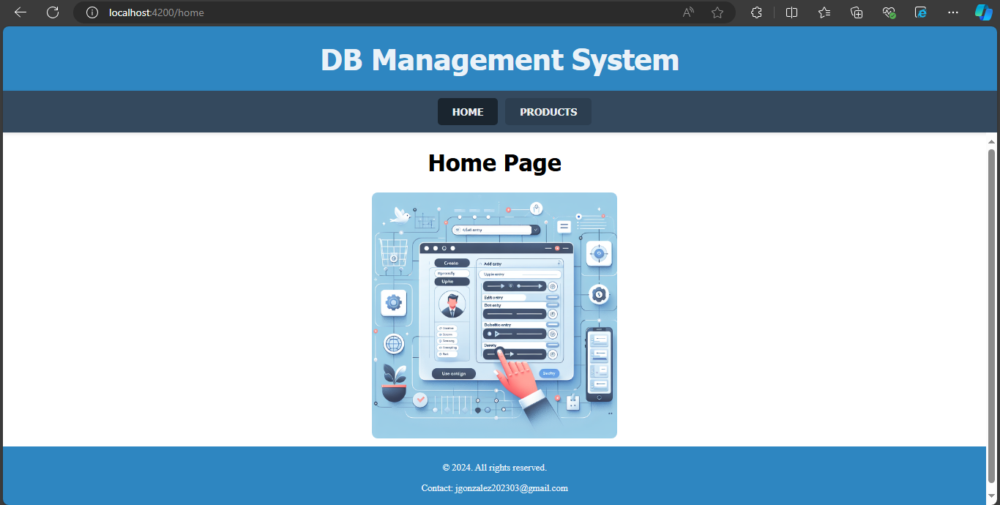

# ASEO PARA EL MUNDO SAS - SQL CRUD WEBAPP  
  
Un sistema CRUD (Create, Read, Update, Delete) para gestionar información de productos para ASEO PARA EL MUNDO SAS. Desarrollado utilizando Angular para el frontend y .NET Core para el backend, con una base de datos SQL Server para almacenar los datos.

## Tecnologías  
  
- .NET Core  
- Angular  
- SQL Server  
  
## Requisitos previos  
  
- Tener instalado .NET Core, puedes descargarlo [aquí](https://dotnet.microsoft.com/download)  
- Tener instalado Node.js y npm, puedes descargarlos [aquí](https://nodejs.org/en/download/)  
- Tener instalado Angular CLI, puedes instalarlo con `npm install -g @angular/cli`  
- Tener instalado SQL Server Express, puedes descargarlo [aquí](https://www.microsoft.com/en-us/sql-server/sql-server-downloads)  
  
## Instalación  
  
1. Clonar el repositorio: `git clone https://github.com/JKGG26/webapp_JS_Ang.git`  
2. Navegar hasta el directorio del proyecto: `cd WEBAPP_JS_AN`  
3. Instalar las dependencias del backend: `cd webapp_Aseos && dotnet restore`
4. Asegurarse de que el paquete de CORS está instalado: `dotnet add package Microsoft.AspNetCore.Cors` 
5. Instalar las dependencias del frontend: `cd ../frontApp && npm install`
6. Verificar que el archivo `appsettings.json` en la carpeta `webapp_Aseos` tiene la cadena de conexión correcta a la base de datos. Debería verse así: "DefaultConnection": "Server=localhost\\SQLEXPRESS;Database=AseoParaElMundoDB;Trusted_Connection=True;MultipleActiveResultSets=true;TrustServerCertificate=true"
  
## Configuración de la base de datos  
  
1. Abrir SQL Server Management Studio.  
2. Conectarse a la instancia de SQL Server Express.  
3. Ejecutar el script SQL proporcionado para crear la base de datos, la tabla y los datos de prueba siguiendo las instrucciones en los comentarios del archivo. El script se encuentra en el archivo `create_db_table.sql` en la raíz del repositorio.
  
## Ejecución del proyecto  
  
1. Ejecutar el backend: `cd ../webapp_Aseos && dotnet run`  
2. En una nueva terminal, navegar hasta el directorio del frontend: `cd ../frontApp`  
3. Ejecutar el frontend: `ng serve`
4. Abrir un navegador web y pear la url que muestra la terminal con el frontend en ejecución (Como `http://localhost:4200`)

## Uso de la aplicación  
  
Al abrir la aplicación, serás redirigido a la página de inicio con una imagen en el centro de la pantalla. En la parte superior de la página, hay una barra de navegación con un botón de 'Home' y 'Products' que redirige a la página donde se encuentran las funcionalidades CRUD de la aplicación para la base de datos SQL Server asociada:

La página 'Products' consta de 2 secciones: El panel de control y la vista de tabla.
  
- **Ver Todos los Productos:** Al ingresar a la página, inmediatamente todos los productos de la base de datos son cargados en la tabla de la derecha. También, si se ha aplicado alguna operación que cambiara la información mostrada en la tabla, se puede hacer click sobre el botón 'See All' para mostrar todos los productos actualizados de la base de datos en la tabla.
  
- **Ver Detalles:** Para ver los detalles de un único producto en la tabla, se puede ingresar el id (Mayor a cero 0) del producto a revisar y hacer click sobre el botón 'Get'.
  
- **Editar Producto:** Para editar/actualizar la información de un producto, se debe ingresar el id en el campo de texto 'ID' y llenar los datos del producto en los demás campos 'Name', 'Description', 'Price' y 'Stock' respectivamente y hacer click sobre 'Edit'. Finalmente, puede ingresar el 'id' del producto que se acaba de actualizar y darle al botón 'Get' para validar la información actualizada.

- **Crear Producto:** Para crear o agregar un producto en la base de datos, se debe llenar los datos del producto en los campos 'Name', 'Description', 'Price' y 'Stock' respectivamente y hacer click sobre 'Create' (El id no es necesario ingresar porque la base de datos lo asigna automáticamente). Finalmente, se puede hacer click en 'See All' y buscar el producto creado al final de la tabla.

- **Eliminar Producto:** Para eliminar un producto de la base de datos, se puede ingresar el id (Mayor a cero 0) del producto a revisar y hacer click sobre el botón 'Delete'.

- **Clear:** Adicionalmente, el panel de control tiene un botón 'Clear' que limpia los campos de entrada de texto.

## Contacto

Si tienes preguntas o encuentras algún problema con la aplicación, no dudes en contactar a jgonzalez202303@gmail.com.